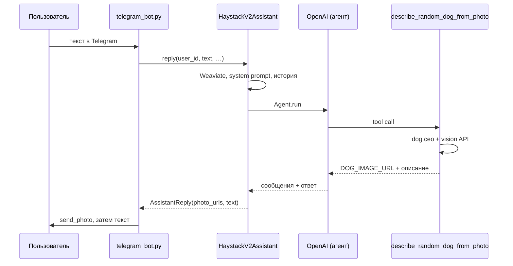

# VPg07: Telegram + Haystack Agent + Weaviate + эмбеддинги (ProxyAPI)

## Краткое описание

В репозитории **два режима** одного стека (Haystack, Weaviate, OpenAI-совместимый API, pyTelegramBotAPI):

| Режим | Модуль | Назначение |
|--------|--------|------------|
| **Личный чат** | `vpg_telegram.v2` | Персональный **агент** с tool calling, памятью в Weaviate, загрузкой PDF/DOCX через **Docling**, инструментами (кошки, собака + vision). |
| **Групповой чат** | `vpg_telegram.group` | Бот для **группы / супергруппы**: **текст сообщений участников** пишется в отдельную коллекцию Weaviate; сессия **`/listen on` … `off`** дополнительно копит транскрипт и по **`/listen off`** даёт **сводку** (тоже в индекс). Ответы по **@упоминанию** или **reply** — **RAG** по контексту чата. Личные документы и агентские tools не используются. |

**Личный бот (v2) подробнее.** Ответы через **OpenAI-совместимый API** ([ProxyAPI](https://proxyapi.ru/docs/overview)), долговременная память и чанки файлов в **[Weaviate Cloud](https://console.weaviate.cloud/)** через **`weaviate-haystack`**. В коллекции для диалога в Weaviate для «памяти» сохраняется **только текст пользователя** (`role=user`); **чанки файлов** — отдельно с метаданными (`filename`, `chunk_index` и др.). Разбор документов — **[Docling](https://docling-project.github.io/docling/)** и **Haystack `Pipeline`**. Инструменты: факт о кошках, случайная собака + **vision**, `send_photo` без дублирования старых URL.

**Групповой бот подробнее.** Задайте **`WEAVIATE_GROUP_COLLECTION_NAME`** (не смешивать с коллекцией личного бота). Добавьте бота в группу; при необходимости отключите **privacy mode** у бота в BotFather, иначе он не увидит обычные сообщения. Команды: **`/listen on`** или **`/listen_on`** — отметить начало сессии (накопление транскрипта для сводки); **`/listen off`** или **`/listen_off`** — остановить и сгенерировать краткую **сводку** сессии; далее вопросы к базе знаний чата — **reply** на сообщение бота или **`@username`** бота в тексте.

**Как запускать (общее).** `cp .env.example .env`, задать `WEAVIATE_URL`, `WEAVIATE_API_KEY`, `OPENAI_API_KEY` и **`TELEGRAM_BOT_TOKEN`** (см. `.env.example`). Какой именно модуль стартует в Docker, задаётся **`command`** в `docker-compose.yml` (сейчас по умолчанию групповой бот). Логи: `docker compose logs -f bot`. Остановка: `docker compose down`.

**Один токен Telegram и два режима.** У **одного** бота BotFather — **один** токен и один процесс long polling: **нельзя** одновременно в одном процессе быть и личным v2, и групповым ботом. Варианты:

1. **Два бота в BotFather** — два `TELEGRAM_BOT_TOKEN`, два контейнера (или два процесса), в одном `command: … vpg_telegram.v2`, в другом `… vpg_telegram.group`; в `.env` удобно завести, например, `TELEGRAM_BOT_TOKEN_PERSONAL` и `TELEGRAM_BOT_TOKEN_GROUP` и пробросить их в `environment` каждого сервиса как `TELEGRAM_BOT_TOKEN` (остальные ключи OpenAI/Weaviate могут быть общими).
2. **Один бот** — выберите режим: в `docker-compose.yml` смените `command` на нужный модуль **или** запускайте локально по очереди `python -m vpg_telegram.v2` и `python -m vpg_telegram.group` с тем же `.env` (не параллельно).

Исходящие запросы к **Telegram Bot API**, к ProxyAPI и к **Weaviate** идут по **HTTPS**. Входящий HTTP/TLS-сервер приложение **не поднимает** — бот работает через **long polling** ([pyTelegramBotAPI](https://github.com/eternnoir/pyTelegramBotAPI)).

Структура кода согласована с [Guide](https://github.com/SpiritWalker84/Guide) (`docs/conventions/`).

## Стек

Python **3.12**, **haystack-ai**, **weaviate-haystack**, **weaviate-client** v4, **docling-haystack**, **docling**, **OpenAI SDK**, **pyTelegramBotAPI**, **requests**, **python-dotenv**, Docker / Compose. В образе **PyTorch** ставится в **CPU-сборке** (индекс `download.pytorch.org/whl/cpu`), без пакетов NVIDIA.

## Структура

| Путь | Назначение |
|------|------------|
| `src/vpg07/config.py` | Загрузка настроек из `.env` |
| `src/vpg07/haystack_assistant.py` | Weaviate (Haystack), эмбеддинги, Agent, память — **точка входа v1** |
| `src/vpg07/tools_external.py` | Инструменты: `fetch_random_cat_fact`, `describe_random_dog_from_photo` (+ константы `TOOL_NAME_*`) |
| `src/vpg07/bot.py` | Telegram-бот v1 (long polling), `main.py` |
| `vpg_telegram/v2/` | Личный бот: Docling, файлы, Weaviate, инструменты (модуль `vpg_telegram.v2`) |
| `vpg_telegram/v2/main.py` | Точка входа v2: `python -m vpg_telegram.v2` *(Dockerfile по умолчанию)* |
| `vpg_telegram/v2/bot/telegram_bot.py` | Telegram: текст, документы, команды |
| `vpg_telegram/v2/components/`, `pipelines/`, … | Weaviate v2, ингест, ассистент, пайплайны Haystack |
| `vpg_telegram/v2/config.py` | Опции чанков и `FILE_RAG_TOP_K` поверх `vpg07.config` |
| `vpg_telegram/group/` | Групповой бот: индексация сообщений в Weaviate, `/listen`, RAG по @mention/reply *(модуль `vpg_telegram.group`)* |
| `main.py` | Запуск v1 без модуля загрузки файлов через Docling |
| `.env.example` | Переменные окружения |
| `requirements.txt` | Зависимости приложения (без pytest) |
| `requirements-dev.txt` | Pytest для локальной проверки |
| `docker-compose.yml`, `Dockerfile`, `.dockerignore` | Сборка и запуск контейнера |
| `tests/` | Pytest (`test_memory_policy.py` и др.) |

## Запуск

### Docker Compose (основной способ)

```bash
cp .env.example .env
# WEAVIATE_URL, WEAVIATE_API_KEY, OPENAI_API_KEY; для группы — WEAVIATE_GROUP_COLLECTION_NAME
# TELEGRAM_BOT_TOKEN — см. раздел про один/два токена выше

docker compose up -d --build
docker compose logs -f bot
```

В `docker-compose.yml` поле **`command`** задаёт модуль: например `python -m vpg_telegram.group` (группа) или `python -m vpg_telegram.v2` (личный). В образе `PYTHONPATH=/app/src:/app`.

**Два бота одновременно в Compose.** Дублируйте сервис (два блока `build` с тем же `dockerfile`), разные имена контейнеров, в одном `command` — `vpg_telegram.v2`, в другом — `vpg_telegram.group`, и задайте **разные** значения `TELEGRAM_BOT_TOKEN` через `environment` (из двух переменных в `.env`). Weaviate и OpenAI в обоих сервисах могут ссылаться на один и тот же `env_file`.

### Локально

```bash
python3 -m venv .venv && source .venv/bin/activate
pip install -r requirements.txt
cp .env.example .env
PYTHONPATH=src:. python -m vpg_telegram.v2
```

Групповой бот (тот же `.env`, другой токен — если используете отдельного бота): `PYTHONPATH=src:. python -m vpg_telegram.group`.

Вариант **без** загрузки файлов (логика как отдельный минимальный бот v1): `PYTHONPATH=src python main.py`.

### Тесты (без Telegram)

```bash
pip install -r requirements-dev.txt
PYTHONPATH=src:. pytest
```

## Команды бота

### Личный бот (`vpg_telegram.v2`)

| Команда / ввод | Действие |
|----------------|----------|
| `/start` | Приветствие и описание возможностей |
| `/help` | Справка |
| Текст (не команда) | Агент + память Weaviate + фрагменты загруженных документов + инструменты по необходимости |
| Документ PDF / DOCX / DOC | Разбор Docling, чанки в Weaviate, краткое резюме, далее — вопросы по содержимому |

### Групповой бот (`vpg_telegram.group`)

| Команда / ввод | Действие |
|----------------|----------|
| `/start`, `/help` | Краткая справка (в группе и в личке с ботом) |
| `/listen on` или `/listen_on` | Начать сессию «слушаю»: **накопление транскрипта** для **сводки** при `/listen off` *(запись реплик в Weaviate идёт и вне сессии)* |
| `/listen off` или `/listen_off` | Остановить сессию, краткая **сводка** по накопленному контексту |
| Reply на сообщение бота **или** текст с `@bot` | Вопрос: **RAG** по проиндексированным сообщениям чата и ответ |
| Любое обычное текстовое сообщение в группе | **Индексация** в Weaviate (кроме самого бота и строк, начинающихся с `/`); сессия `/listen` дополнительно копит транскрипт для **сводки** при `/listen off` |

## Путь запроса: пример vision-инструмента (случайная собака)

Ниже тот же сценарий, что в коде: от реплики пользователя до `send_photo` в Telegram. Имя инструмента в API — `describe_random_dog_from_photo` (в модуле зафиксировано как `TOOL_NAME_DESCRIBE_RANDOM_DOG_VISION`).

1. Пользователь пишет в чат, например: «покажи случайную собаку и опиши породу».
2. `on_text` → `HaystackV2Assistant.reply`: семантический поиск по Weaviate (память пользователя и чанки файлов), сбор системного промпта (там перечислены имена инструментов, см. `vpg_telegram/v2/components/assistant.py`), история сессии.
3. `Agent.run` (Haystack) → модель решает вызвать tool **`describe_random_dog_from_photo`**.
4. Реализация в `tools_external.build_external_tools` → `describe_random_dog_from_photo`: HTTP к dog.ceo, затем OpenAI **vision** по URL картинки; первая строка результата `DOG_IMAGE_URL:…` нужна боту.
5. `reply` собирает `AssistantReply`: URL извлекаются из tool-сообщений текущего хода, текст ответа очищается от дублирования ссылки.
6. Бот отправляет фото через `send_photo` по URL, затем текст пользователю.



## Конфигурация

См. **`.env.example`**. `EMBEDDING_DIMENSION` должен совпадать с размерностью векторов (для `text-embedding-3-small` обычно **1536**). Для бота с загрузкой файлов задайте **отдельное** `WEAVIATE_COLLECTION_NAME` (расширенная схема с полями для чанков; не смешивать с коллекциями VPg05/VPg06).

| Переменная | Обязательность | Описание |
|------------|----------------|----------|
| `OPENAI_API_KEY` | да | Ключ ProxyAPI / совместимого API |
| `OPENAI_API_BASE` | нет | По умолчанию `https://api.proxyapi.ru/openai/v1`; запасной ключ `OPENAI_BASE_URL` |
| `OPENAI_CHAT_MODEL` | нет | Модель чата для агента |
| `OPENAI_VISION_MODEL` | нет | Vision для собаки (по умолчанию совпадает с `OPENAI_CHAT_MODEL`) |
| `OPENAI_EMBEDDING_MODEL` | нет | Модель эмбеддингов |
| `EMBEDDING_DIMENSION` | нет | Размерность векторов (**1536** для `text-embedding-3-small`) |
| `WEAVIATE_URL` | да | Endpoint кластера Weaviate Cloud |
| `WEAVIATE_API_KEY` | да | API key Weaviate |
| `WEAVIATE_COLLECTION_NAME` | нет | Имя коллекции (по умолчанию `Vpg07HaystackMemory`; для v2 с файлами — отдельное имя, см. `.env.example`) |
| `WEAVIATE_GROUP_COLLECTION_NAME` | нет | Коллекция **только для группового бота** (по умолчанию `Vpg07GroupChat`); не смешивать с v1/v2 |
| `GROUP_RAG_TOP_K` | нет | Сколько фрагментов в контекст RAG (группа) |
| `GROUP_SESSION_MAX_CHARS` | нет | Лимит символов транскрипта сессии «слушаю» |
| `GROUP_MENTION_MAX_TOKENS` | нет | Лимит токенов ответа при @mention / reply |
| `GROUP_SESSION_SUMMARY_MAX_TOKENS` | нет | Лимит токенов сводки по `/listen off` |
| `TELEGRAM_BOT_TOKEN` | да | Токен от [@BotFather](https://t.me/BotFather); для двух режимов параллельно — второй бот и второй токен во втором процессе |
| `MEMORY_TOP_K` | нет | Сколько фрагментов памяти (сообщения пользователя) в системный промпт |
| `FILE_RAG_TOP_K` | нет | Сколько чанков загруженных документов в промпт |
| `DOC_CHUNK_WORDS` | нет | Длина чанка (слова) после Docling |
| `DOC_CHUNK_OVERLAP` | нет | Перекрытие чанков |
| `DOC_SUMMARY_MAX_CHARS` | нет | Лимит текста для одно-предложенного резюме после файла |
| `CHAT_HISTORY_MAX_MESSAGES` | нет | Лимит сообщений истории в сессии |
| `MAX_AGENT_STEPS` | нет | Лимит шагов агента |
| `LOG_LEVEL` | нет | Уровень логирования (`INFO` по умолчанию) |

Секреты в git не коммитить.

## Проверка задания (кратко)

1. **Память:** в Weaviate только реплики пользователя для фильтра «память» — см. код и `tests/test_memory_policy.py` (политика v1; в расширенной коллекции дополнительно хранятся чанки файлов).
2. **Контекст:** уникальная фраза в чате → позже вопрос по ней; релевантные фрагменты подставляются из Weaviate.
3. **Инструменты:** запрос факта о кошках; запрос случайной собаки — фото в чат + текст описания (один новый URL за запрос).
4. **Файлы:** загрузка PDF/DOCX → сообщение о прогрессе → «Готово» и краткое резюме; вопрос по содержимому файла опирается на проиндексированные чанки.
5. **Weaviate:** у чанков файлов в метаданных видны `user_id`, `source_kind`, `filename`, `chunk_index` (и др. по схеме в коде).
