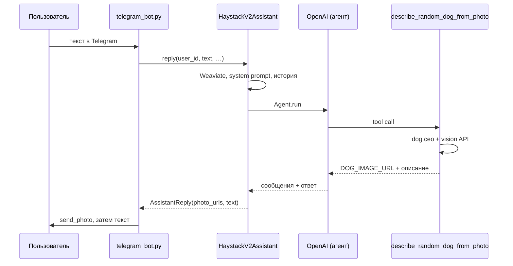

# VPg07: Telegram + Haystack Agent + Weaviate + эмбеддинги (ProxyAPI)

## Краткое описание

**Что делает.** Учебный Telegram-бот — **персональный агент** на **[Haystack](https://haystack.deepset.ai/overview/quick-start)** (`Agent`, tool calling): ответы через **OpenAI-совместимый API** ([ProxyAPI](https://proxyapi.ru/docs/overview)), долговременная память и контекст загруженных документов в **[Weaviate Cloud](https://console.weaviate.cloud/)** через **`weaviate-haystack`** ([`WeaviateDocumentStore`](https://haystack.deepset.ai/integrations/weaviate-document-store)), семантический поиск по эмбеддингам (запросы к API, не локальные модели эмбеддингов). В **Weaviate** сохраняется **только текст сообщений пользователя** (`role=user`) для семантической «памяти»; **чанки загруженных файлов** (PDF, DOCX, DOC) индексируются отдельно с метаданными (`filename`, `chunk_index` и др.). Ответы ассистента в базу не пишутся. Краткий контекст диалога — в памяти процесса. Разбор документов — **[Docling](https://docling-project.github.io/docling/)** через **[docling-haystack](https://haystack.deepset.ai/integrations/docling)** и **Haystack `Pipeline`** (конвертация в Markdown, затем чанкование `DocumentSplitter`). Инструменты: факт о кошках (`catfact.ninja`), случайное фото собаки (`dog.ceo`) + описание через **vision**; фото дублируется в чат через `send_photo` (без повторной отправки старых картинок при повторном запросе).

**Как запускать.** `cp .env.example .env`, задать `WEAVIATE_URL`, `WEAVIATE_API_KEY`, `TELEGRAM_BOT_TOKEN`, `OPENAI_API_KEY` (см. `.env.example`). Затем `docker compose up -d --build`. Логи: `docker compose logs -f bot`. Остановка: `docker compose down`.

Исходящие запросы к **Telegram Bot API**, к ProxyAPI и к **Weaviate** идут по **HTTPS**. Входящий HTTP/TLS-сервер приложение **не поднимает** — бот работает через **long polling** ([pyTelegramBotAPI](https://github.com/eternnoir/pyTelegramBotAPI)).

Структура кода согласована с [Guide](https://github.com/SpiritWalker84/Guide) (`docs/conventions/`).

## Стек

Python **3.12**, **haystack-ai**, **weaviate-haystack**, **weaviate-client** v4, **docling-haystack**, **docling**, **OpenAI SDK**, **pyTelegramBotAPI**, **requests**, **python-dotenv**, Docker / Compose. В образе **PyTorch** ставится в **CPU-сборке** (индекс `download.pytorch.org/whl/cpu`), без пакетов NVIDIA.

## Структура

| Путь | Назначение |
|------|------------|
| `src/vpg07/config.py` | Загрузка настроек из `.env` |
| `src/vpg07/haystack_assistant.py` | Weaviate (Haystack), эмбеддинги, Agent, память — **точка входа v1** |
| `src/vpg07/tools_external.py` | Инструменты: `fetch_random_cat_fact`, `describe_random_dog_from_photo` (+ константы `TOOL_NAME_*`) |
| `src/vpg07/bot.py` | Telegram-бот v1 (long polling), `main.py` |
| `hay_v2_bot/main.py` | Точка входа **основного** бота (Compose и Dockerfile по умолчанию) |
| `hay_v2_bot/bot/telegram_bot.py` | Telegram: текст, документы, команды |
| `hay_v2_bot/components/` | Weaviate-схема v2, ингест файлов, ассистент, резюме |
| `hay_v2_bot/pipelines/` | Пайплайны Haystack: Docling + сплиттер; эмбеддинги + `DocumentWriter` |
| `hay_v2_bot/config.py` | Опции чанков и `FILE_RAG_TOP_K` поверх `vpg07.config` |
| `main.py` | Запуск v1 без модуля загрузки файлов через Docling |
| `.env.example` | Переменные окружения |
| `requirements.txt` | Зависимости приложения (без pytest) |
| `requirements-dev.txt` | Pytest для локальной проверки |
| `docker-compose.yml`, `Dockerfile`, `.dockerignore` | Сборка и запуск контейнера |
| `tests/` | Pytest (`test_memory_policy.py` и др.) |

## Запуск

### Docker Compose (основной способ)

```bash
cp .env.example .env
# WEAVIATE_URL, WEAVIATE_API_KEY, TELEGRAM_BOT_TOKEN, OPENAI_API_KEY

docker compose up -d --build
docker compose logs -f bot
```

Контейнер: `python hay_v2_bot/main.py` (в образе `PYTHONPATH=/app/src:/app`).

### Локально

```bash
python3 -m venv .venv && source .venv/bin/activate
pip install -r requirements.txt
cp .env.example .env
PYTHONPATH=src:. python hay_v2_bot/main.py
```

Вариант **без** загрузки файлов (логика как отдельный минимальный бот): `PYTHONPATH=src python main.py`.

### Тесты (без Telegram)

```bash
pip install -r requirements-dev.txt
PYTHONPATH=src pytest
```

## Команды бота

| Команда / ввод | Действие |
|----------------|----------|
| `/start` | Приветствие и описание возможностей |
| `/help` | Справка |
| Текст (не команда) | Агент + память Weaviate + фрагменты загруженных документов + инструменты по необходимости |
| Документ PDF / DOCX / DOC | Разбор Docling, чанки в Weaviate, краткое резюме, далее — вопросы по содержимому |

## Путь запроса: пример vision-инструмента (случайная собака)

Ниже тот же сценарий, что в коде: от реплики пользователя до `send_photo` в Telegram. Имя инструмента в API — `describe_random_dog_from_photo` (в модуле зафиксировано как `TOOL_NAME_DESCRIBE_RANDOM_DOG_VISION`).

1. Пользователь пишет в чат, например: «покажи случайную собаку и опиши породу».
2. `on_text` → `HaystackV2Assistant.reply`: семантический поиск по Weaviate (память пользователя и чанки файлов), сбор системного промпта (там перечислены имена инструментов, см. `hay_v2_bot/components/assistant.py`), история сессии.
3. `Agent.run` (Haystack) → модель решает вызвать tool **`describe_random_dog_from_photo`**.
4. Реализация в `tools_external.build_external_tools` → `describe_random_dog_from_photo`: HTTP к dog.ceo, затем OpenAI **vision** по URL картинки; первая строка результата `DOG_IMAGE_URL:…` нужна боту.
5. `reply` собирает `AssistantReply`: URL извлекаются из tool-сообщений текущего хода, текст ответа очищается от дублирования ссылки.
6. Бот отправляет фото через `send_photo` по URL, затем текст пользователю.



## Конфигурация

См. **`.env.example`**. `EMBEDDING_DIMENSION` должен совпадать с размерностью векторов (для `text-embedding-3-small` обычно **1536**). Для бота с загрузкой файлов задайте **отдельное** `WEAVIATE_COLLECTION_NAME` (расширенная схема с полями для чанков; не смешивать с коллекциями VPg05/VPg06).

| Переменная | Обязательность | Описание |
|------------|----------------|----------|
| `OPENAI_API_KEY` | да | Ключ ProxyAPI / совместимого API |
| `OPENAI_API_BASE` | нет | По умолчанию `https://api.proxyapi.ru/openai/v1`; запасной ключ `OPENAI_BASE_URL` |
| `OPENAI_CHAT_MODEL` | нет | Модель чата для агента |
| `OPENAI_VISION_MODEL` | нет | Vision для собаки (по умолчанию совпадает с `OPENAI_CHAT_MODEL`) |
| `OPENAI_EMBEDDING_MODEL` | нет | Модель эмбеддингов |
| `EMBEDDING_DIMENSION` | нет | Размерность векторов (**1536** для `text-embedding-3-small`) |
| `WEAVIATE_URL` | да | Endpoint кластера Weaviate Cloud |
| `WEAVIATE_API_KEY` | да | API key Weaviate |
| `WEAVIATE_COLLECTION_NAME` | нет | Имя коллекции (по умолчанию `Vpg07HaystackMemory`; для режима с файлами — отдельное имя, см. комментарии в `.env.example`) |
| `TELEGRAM_BOT_TOKEN` | да | Токен от [@BotFather](https://t.me/BotFather) |
| `MEMORY_TOP_K` | нет | Сколько фрагментов памяти (сообщения пользователя) в системный промпт |
| `FILE_RAG_TOP_K` | нет | Сколько чанков загруженных документов в промпт |
| `DOC_CHUNK_WORDS` | нет | Длина чанка (слова) после Docling |
| `DOC_CHUNK_OVERLAP` | нет | Перекрытие чанков |
| `DOC_SUMMARY_MAX_CHARS` | нет | Лимит текста для одно-предложенного резюме после файла |
| `CHAT_HISTORY_MAX_MESSAGES` | нет | Лимит сообщений истории в сессии |
| `MAX_AGENT_STEPS` | нет | Лимит шагов агента |
| `LOG_LEVEL` | нет | Уровень логирования (`INFO` по умолчанию) |

Секреты в git не коммитить.

## Проверка задания (кратко)

1. **Память:** в Weaviate только реплики пользователя для фильтра «память» — см. код и `tests/test_memory_policy.py` (политика v1; в расширенной коллекции дополнительно хранятся чанки файлов).
2. **Контекст:** уникальная фраза в чате → позже вопрос по ней; релевантные фрагменты подставляются из Weaviate.
3. **Инструменты:** запрос факта о кошках; запрос случайной собаки — фото в чат + текст описания (один новый URL за запрос).
4. **Файлы:** загрузка PDF/DOCX → сообщение о прогрессе → «Готово» и краткое резюме; вопрос по содержимому файла опирается на проиндексированные чанки.
5. **Weaviate:** у чанков файлов в метаданных видны `user_id`, `source_kind`, `filename`, `chunk_index` (и др. по схеме в коде).
